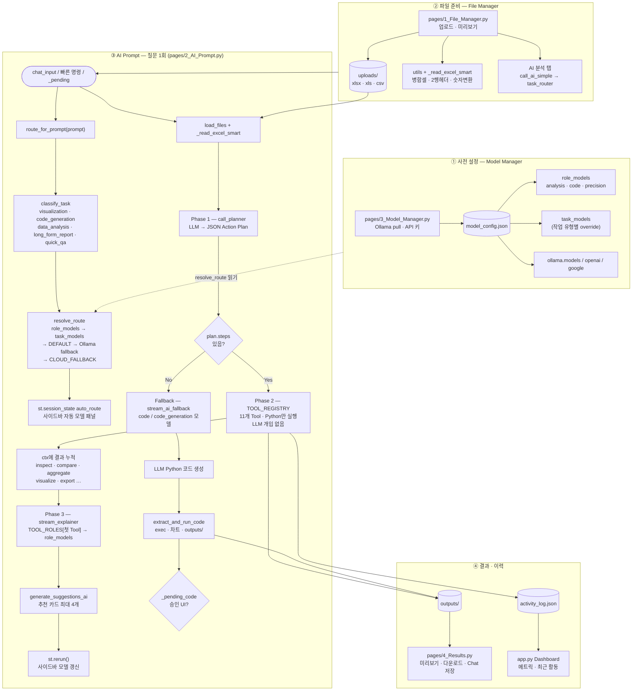
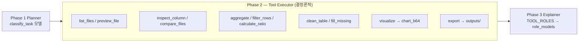
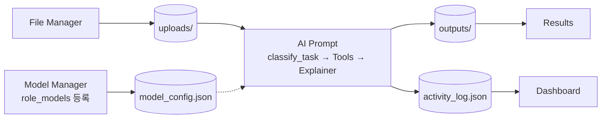
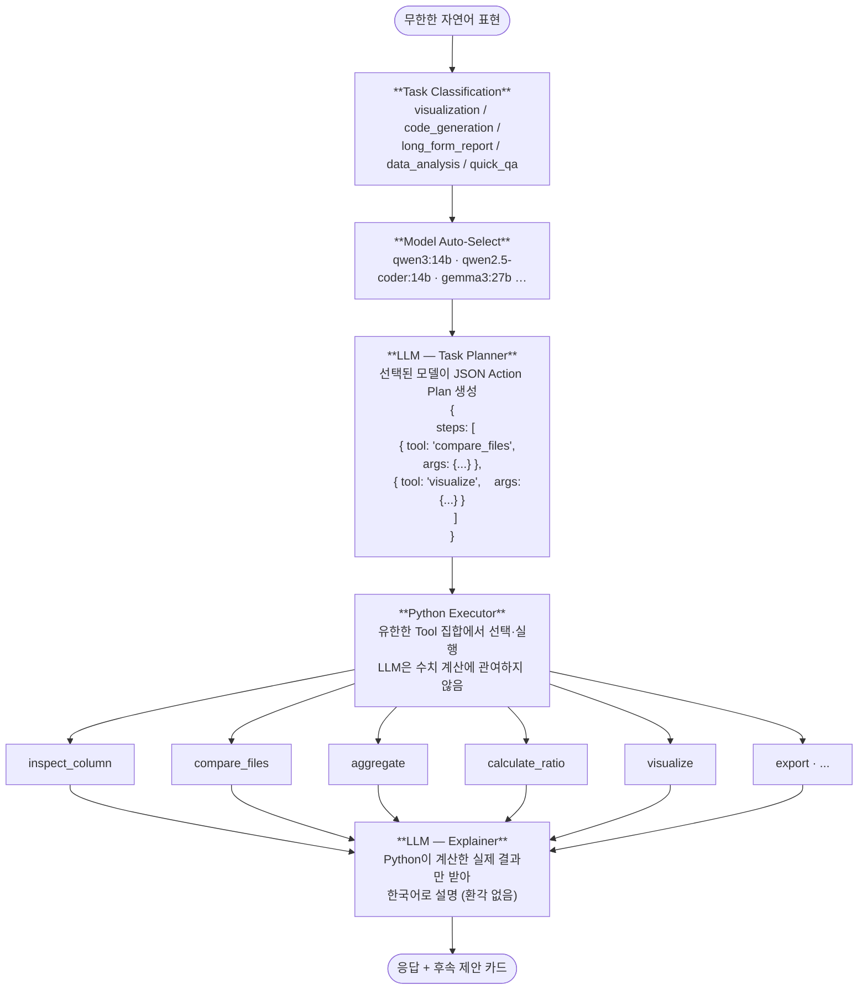
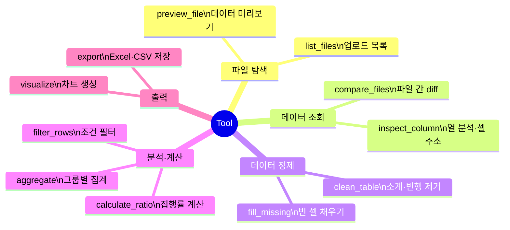

# AI Prompt Platform

엑셀·CSV 파일을 자연어로 분석·처리하는 Streamlit 기반 AI 데이터 플랫폼.

핵심은 두 가지입니다.

1. **자동 모델 선택** — 사용자가 모델을 고르지 않습니다. 작업 유형을 분류한 뒤 적합한 모델이 자동으로 선택됩니다.
2. **2-Phase Tool 실행** — LLM이 직접 수치를 판단하지 않고, Python 도구가 실제 계산을 수행한 뒤 LLM이 결과만 설명합니다. 환각(hallucination)을 방지합니다.

---

## 핵심 구조: 자동 모델 선택

> **사용자가 직접 모델을 고르게 하면 안 됩니다.**  
> Model Manager는 모델 풀(pool)을 등록·관리하는 곳이지, 매 요청마다 모델을 고르는 UI가 아닙니다.

모든 AI 요청은 아래 [전체 파이프라인](#전체-파이프라인-현재-구현)을 따릅니다.

### 작업 유형 → 모델 매핑 (예시)

| Task Type | 트리거 예시 (사용자 표현) | 자동 선택 모델 | 이유 |
|---|---|---|---|
| `visualization` | "차트 만들어줘", "그래프 그려줘", "막대 차트로 보여줘" | `qwen3:14b` | 시각화·데이터 해석 균형 |
| `code_generation` | "Python 코드 생성해줘", "스크립트 짜줘", "pandas로 처리해" | `qwen2.5-coder:14b` | 코드 생성·실행 특화 |
| `long_form_report` | "긴 보고서 만들어줘", "전체 요약 보고서", "인사이트 정리해" | `gemma3:27b` | 장문 생성·한국어 서술 품질 |
| `data_analysis` | "집행률 계산해줘", "B열 합계", "두 파일 비교" | `qwen2.5:14b` | 표·수치 분석·한국어 |
| `quick_qa` | "이 열이 뭐야?", "몇 행이야?" | `gemma2` / `phi3` | 짧은 응답·저지연 |

표현이 달라도 Task Classifier가 **의도(intent)** 를 분류하면 동일한 모델이 선택됩니다.

```
"차트 그려줘"  ─┐
"그래프 보여줘" ├──→  visualization  →  qwen3:14b
"막대 그래프"  ─┘

"코드 짜줘"    ─┐
"스크립트 작성" ├──→  code_generation  →  qwen2.5-coder:14b
"pandas 처리"  ─┘
```

### 전체 파이프라인 (현재 구현)

플랫폼 전체(설정 → 파일 → AI 처리 → 결과)와 AI Prompt **질문 1회** 처리 흐름을 한 diagram에 정리했습니다.



**Phase 2 Tool 목록 (11개)** — `TOOL_REGISTRY` in `2_AI_Prompt.py`

| 분류 | Tool |
|------|------|
| 파일 탐색 | `list_files`, `preview_file` |
| 분석·정제 | `inspect_column`, `compare_files`, `clean_table`, `aggregate`, `filter_rows`, `calculate_ratio`, `fill_missing` |
| 출력 | `visualize`, `export` |



### 설계 원칙

| 원칙 | 설명 |
|---|---|
| **사용자 무개입** | AI Prompt 사이드바에 모델 선택 UI를 두지 않음 |
| **작업 단위 라우팅** | 한 대화 안에서도 질문마다 task type이 달라지면 모델을 바꿀 수 있음 |
| **풀 기반 폴백** | 지정 모델이 미설치·VRAM 부족 시 같은 task type의 차순위 모델로 대체 |
| **Model Manager 역할** | Ollama/OpenAI/Google **연결·다운로드·풀 등록**만 담당 |

### 모델 결정 우선순위 (`resolve_route`)

`utils/task_router.py`가 아래 순서로 provider·model을 고릅니다.

1. `model_config.json` → **`role_models`** (Model Manager 역할 카드에서 저장)
2. **`task_models`** (작업 유형별 직접 지정, example config 참고)
3. **`DEFAULT_TASK_MODELS`** (코드 내 기본값 — Ollama 로컬)
4. 설치된 Ollama 목록에서 **fallback** 후보 순회
5. Ollama 불가 시 **`CLOUD_FALLBACK`** (OpenAI / Google API 키 필요)

### 구현 코드 맵

| 역할 | 파일 | 주요 심볼 |
|---|---|---|
| 작업 분류·모델 매핑·LLM 호출 | `utils/task_router.py` | `classify_task`, `resolve_route`, `route_for_prompt`, `call_with_route` |
| File Manager 등 단순 호출 | `utils/ai_caller.py` | `call_ai_simple`, `call_ai_for_task` |
| 채팅·2-Phase·사이드바 UI | `pages/2_AI_Prompt.py` | `call_ai_raw`, `call_planner`, `stream_explainer`, `st.session_state["auto_route"]` |
| 모델 풀 등록 UI | `pages/3_Model_Manager.py` | `save_role`, `ROLES`, `role_models` 저장 |
| 공통 CSS | `utils/styles.py` | `apply_global_css` |
| Ollama VRAM 관리 | `utils/ollama_client.py` | `chat`, `iter_chat`, `unload_all_except` |

**질문 입력 시 실제 흐름 (`2_AI_Prompt.py`)**

```
st.chat_input(prompt)
  → route_for_prompt()      # 질문 키워드 → task type → 모델 (auto_route 설정)
  → call_planner()          # classify_task(question) 모델로 JSON 계획 생성
  → Tool 실행 (Phase 2)     # LLM 개입 없음
  → stream_explainer()      # 첫 Tool의 TOOL_ROLES → role_models 모델
  → (실패 시) stream_ai_fallback()  # code_generation → qwen2.5-coder:14b 등
```

사이드바 **「자동 모델」** 은 `st.session_state["auto_route"]`를 읽기 전용으로 표시합니다. 질문 전에는 Model Manager에 등록된 **기본 풀**(`analysis` 역할)을 안내하고, 질문 처리 후에는 선택된 모델명·작업 라벨이 갱신됩니다 (`st.rerun()`).


---

## 디렉토리 구조

```
ai-prompt-platform/
├── app.py                      # Dashboard
├── requirements.txt
├── model_config.json           # 모델 풀·API 키 (자동 생성)
├── model_config.example.json   # role_models / task_models 예시
├── activity_log.json           # 처리 이력 영속화 (자동 생성)
├── code_history.json           # Fallback 코드 히스토리 (자동 생성)
├── .streamlit/
│   └── config.toml             # 테마 설정
├── pages/
│   ├── 1_File_Manager.py       # 파일 업로드·미리보기
│   ├── 2_AI_Prompt.py          # AI 대화 (자동 모델 + 2-Phase Tool)
│   ├── 3_Model_Manager.py      # 모델 풀 등록·Ollama pull
│   └── 4_Results.py            # 결과 파일 관리
├── utils/
│   ├── task_router.py          # ★ 작업 분류 + 모델 자동 선택
│   ├── ai_caller.py            # 공유 AI 호출 (task_router 래핑)
│   ├── activity_log.py         # 로그 영속화
│   ├── styles.py               # 공통 CSS (apply_global_css)
│   ├── excel_processor.py      # 엑셀 처리
│   └── ollama_client.py        # Ollama HTTP·VRAM 관리
├── uploads/                    # 업로드 파일 저장소
└── outputs/                    # 결과 파일 저장소
```

---

## 설치 및 실행

```bash
pip install -r requirements.txt

# 최초 1회: 설정 파일 복사 (선택)
cp model_config.example.json model_config.json

streamlit run app.py
```

브라우저에서 **Model Manager** → Ollama 연결 및 역할별 모델(`analysis` / `code` / `precision`) 지정 후 **AI Prompt**에서 질문하면 자동 라우팅됩니다.

### 의존 패키지

| 패키지 | 용도 |
|---|---|
| streamlit ≥ 1.30 | UI 프레임워크 |
| pandas ≥ 2.0 | 데이터 처리 |
| openpyxl ≥ 3.1 | 엑셀 읽기·쓰기 (병합 셀 처리 필수) |
| matplotlib ≥ 3.7 | 차트 생성 |
| plotly ≥ 5.0 | 인터랙티브 차트 (선택) |
| altair ≥ 5.0 | 대시보드 바 차트 |
| openai ≥ 1.0 | OpenAI API |
| requests ≥ 2.31 | Ollama HTTP 통신 |
| google-generativeai | Google Gemini (선택, requirements.txt 주석 해제) |

---

## 페이지별 기능

### Dashboard (`app.py`)

플랫폼 전체 현황을 한눈에 보여주는 메인 화면.


- **메트릭 카드 4개**: 업로드 파일 수 / 처리 건수 / 등록된 모델 수 / 토큰 사용량
- **모델 풀 상태**: 우상단 배지 — 미등록 시 경고 배너 (요청 시 자동 선택 불가)
- **최근 활동**: `activity_log.json` 기반, 상태 배지(uploaded / processed / saved / deleted / error)
- **주간 통계 차트**: 최근 7일 성공 처리 건수 Altair 바 차트
- **빠른 시작**: 모델 미설정 시 단계 안내 / 설정 완료 시 프롬프트 예시 6개

---

### File Manager (`pages/1_File_Manager.py`)

엑셀·CSV 파일 업로드 및 상세 미리보기.


- **파일 업로드**: 드래그&드롭 (xlsx / xls / csv), `uploads/` 저장
- **파일 목록**: 이름·날짜·크기 표시, 검색 필터, 체크박스 일괄 삭제
- **AI Prompt 연동**: 선택 파일을 AI Prompt 페이지로 바로 전송
- **미리보기 다이얼로그 — 4탭 구성**:
  - `원본`: openpyxl로 원본 시트 그대로 렌더링 (병합 셀 표시 포함)
  - `정리 데이터`: pandas로 읽은 분석용 테이블 + 컬럼별 통계 (숫자: 합계/평균/최솟값/최댓값 / 텍스트: 고유값 목록)
  - `AI 분석`: `call_ai_simple()` → `task_router`로 `data_analysis` 작업 유형 모델 자동 선택 (캐시)
  - `작업 로그`: 해당 파일에 대한 `activity_log.json` 이력 + 세션 코드 히스토리

---

### AI Prompt (`pages/2_AI_Prompt.py`)

핵심 기능. 자연어 질문 → **작업 분류·모델 자동 선택** → Python 도구 실행 → AI 결과 설명.


#### 아키텍처: Task Classification → Auto Model → 2-Phase Tools

요청마다 Task Classifier가 작업 유형을 판별하고, 그에 맞는 모델을 자동으로 로드합니다. 사용자는 모델명을 알 필요가 없습니다. 상세 흐름은 [전체 파이프라인 (현재 구현)](#전체-파이프라인-현재-구현)을 참고하세요.

#### 11개 Python Tool 함수

모든 Tool은 `(args: dict, ctx: dict, dfs: dict) -> dict` 시그니처를 공유.
`ctx`에 이전 Tool 결과가 누적되어 다음 Tool이 참조 가능.

| Tool | 설명 | 주요 args |
|---|---|---|
| `list_files` | `uploads/` 파일 목록·상태 | (없음) |
| `preview_file` | 파일 데이터 미리보기 | `file`, `rows` (기본 20) |
| `inspect_column` | 열 상세 분석 (셀 주소 포함) | `file`, `column` |
| `compare_files` | 두 파일 diff (추가/제거/변경) | `file_a`, `file_b`, `key_col` |
| `clean_table` | 소계·빈 행 제거 | `file`, `remove_subtotals` |
| `aggregate` | 그룹별 집계 (sum/mean 등) | `file`, `group_by`, `value_col`, `func` |
| `filter_rows` | 조건 행 필터 | `file`, `column`, `condition`, `value` |
| `calculate_ratio` | 집행률·비율 계산 (`plan_col`/`exec_col` 미지정 시 키워드 자동 탐지) | `file`, `plan_col`, `exec_col`, `label_col` |
| `fill_missing` | 빈 셀 채우기 | `file`, `method` (zero/ffill/bfill/mean), `columns` |
| `visualize` | 막대/선/파이 차트 생성 | `file`, `chart_type`, `x`, `y` |
| `export` | 결과를 Excel/CSV로 저장 | `source_step`, `filename` |

#### 엑셀 스마트 로딩 (`_read_excel_smart`)

`pd.read_excel()`의 한계를 openpyxl로 보완:

1. **병합 셀 해제**: 모든 병합 범위를 좌상단 값으로 채운 뒤 해제 → 병합으로 인한 NaN 방지
2. **2행 헤더 자동 감지**: 3번째 행에 숫자가 많고 2번째 행이 텍스트이면 1·2행을 합쳐 헤더 구성 (한국 공공 예산 엑셀 형식 대응)
3. **쉼표 포함 숫자 변환**: `'51,840,000'` → `51840000` (60% 이상 셀이 변환 가능하면 열 전체를 숫자형으로 변환)

#### 후속 작업 제안 카드

응답 하단에 `generate_suggestions_ai()`가 **최대 4개** 추천 카드를 표시합니다 (LLM 생성 + `_WORKFLOW_FALLBACK` 정적 fallback). 카드 클릭 시 해당 질문이 입력창에 자동 입력됩니다.

#### 사이드바·헤더 기능

- **자동 모델** (사이드바): 질문 전 `analysis` 기본 풀 안내 → 질문 후 `auto_route` 모델명·작업 라벨 (읽기 전용)
- 파일 멀티선택 (File Manager에서 선택 파일 자동 연동)
- 코드 히스토리 (최근 8개, 클릭 시 재실행)
- **대화 초기화** (사이드바 + 메인 헤더)

#### Tool → LLM 역할 (`TOOL_ROLES`)

| 단계 | 모델 선택 방식 |
|---|---|
| **Planner** (`call_planner`) | `classify_task(질문)` → 작업 유형별 모델 |
| **Explainer** (`stream_explainer`) | 계획 **첫 번째 Tool**의 `TOOL_ROLES` → `role_models` |
| **Fallback** (`stream_ai_fallback`) | `code` / `code_generation` 고정 |

| Tool 예시 | `TOOL_ROLES` | Model Manager 역할 |
|---|---|---|
| `list_files`, `preview_file`, `aggregate`, `compare_files`, `calculate_ratio` … | `analysis` | 엑셀 분석 |
| `visualize` | `code` | 코드 실행 |
| Fallback `exec()` | `code` | 코드 실행 |

---

### Model Manager (`pages/3_Model_Manager.py`)

**모델 풀 등록·연결** 전용 페이지. 사용자가 매 요청마다 모델을 고르는 곳이 아닙니다.  
`save_role()`로 저장한 **`role_models`** 가 `task_router.resolve_route()`의 1순위 설정입니다.

| 역할 키 | 용도 | 권장 Ollama 모델 예 |
|---|---|---|
| `analysis` | Planner·표 분석·집계 | `qwen3:14b` |
| `code` | 차트·Fallback 코드 생성 | `qwen2.5-coder:14b` |
| `precision` | 장문 보고서·복잡 추론 | `gemma3:27b` |
| `embedding` | RAG·유사도 검색 (예정) | `nomic-embed-text` |

- **OpenAI / Google**: API 키·모델 풀 등록 (Ollama 없을 때 클라우드 폴백)
- **Ollama (local/remote)**: 자동 감지, `ollama pull`, 설치 목록 → `ollama.models`
- Ollama 모델 전환 시 VRAM 정리 (`unload_all_except`)

---

### Results (`pages/4_Results.py`)

결과 파일 관리 및 대화 내보내기.

- **Chat 저장**: Results 페이지 헤더 버튼 — Streamlit 세션의 `messages`(AI Prompt 대화)를 Markdown으로 `outputs/`에 저장
- **Markdown 작성**: 새 메모·보고서 직접 작성
- **파일 목록**: 파일명·유형 배지(markdown/excel/csv)·날짜·크기
- **미리보기**: `.md` → 렌더링 / `.xlsx,.xls` → 데이터프레임(최대 50행) / `.csv` → 데이터프레임
- **다운로드 / 삭제** 버튼

---

## 데이터 흐름

페이지·저장소 관점 요약입니다. 질문 처리 상세는 [전체 파이프라인 (현재 구현)](#전체-파이프라인-현재-구현)을 참고하세요.



---

## 설계 철학: 자연어 → Task Classification → Auto Model → Tool 실행

### 기존 방식의 근본적 문제

초기 버전은 키워드 매칭 기반 **명령어 파서**였습니다.

```python
if "통합" in prompt or "합쳐" in prompt:
    merge_files()
elif "정렬" in prompt:
    sort_file()
```

표현이 조금만 달라져도 실패합니다. "5개 파일 합쳐줘"는 되지만, "B열 기준으로 정렬해줘"나 "3번째 시트만 추출해줘"처럼 사전에 등록하지 않은 요청은 전부 처리 불가능합니다. **질문이 새로 생길 때마다 코드를 추가**해야 하는 구조로, 확장성이 없습니다.


---

### 개선된 구조: 자연어 → Action Plan → Tool 실행

Cursor·Copilot과 동일한 구조입니다. 표현이 달라도 LLM이 의도를 해석해 **유한한 Tool 집합** 중 하나를 선택합니다.

```
"빈 셀 메꿔줘"
"병합셀 채워줘"        →  LLM 해석  →  fill_missing 호출
"누락값 처리해줘"

"달라진 항목 알려줘"
"증감 분석해줘"        →  LLM 해석  →  compare_files 호출
"변경점 요약해줘"
```



---

### 핵심 원칙: Tool 설계가 전부다

새 질문 유형이 생겨도 **Tool을 추가**하면 끝입니다. LLM이 알아서 새 Tool을 선택합니다.
반대로 Tool 설계가 나쁘면 LLM의 플래닝도 나빠집니다.

| 원칙 | 설명 |
|---|---|
| **범용성** | Tool 하나가 넓은 범위의 질문을 커버해야 함 |
| **명확한 args** | LLM이 잘못 해석할 수 없도록 args 이름을 직관적으로 |
| **결정론적 실행** | Tool 내부는 순수 Python — 같은 입력은 항상 같은 결과 |
| **ctx 누적** | 이전 Tool 결과를 다음 Tool이 참조 가능하도록 연결 |

현재 구현된 11개 Tool로 처리 가능한 실무 요청 범위:



---

### Fallback: 코드 생성 방식

Tool로 처리할 수 없는 요청(LLM이 Action Plan 생성에 실패한 경우)은 **코드 생성 방식**으로 전환됩니다. LLM이 pandas Python 코드를 직접 작성하고, `exec()`로 실행한 뒤 결과·차트·파일을 반환합니다. 파일의 실제 데이터(컬럼, 행 수, 샘플)를 시스템 프롬프트로 전달하므로 "샘플 데이터 기준" 가정 없이 동작합니다.


---

## 지원 모델 (자동 선택 풀)

Model Manager에 등록해 두면 Task Classifier가 작업 유형에 맞게 자동으로 고릅니다.

| Provider | Task Type | 자동 선택 예시 | 비고 |
|---|---|---|---|
| Ollama (local) | `visualization` | `qwen3:14b` | 차트·그래프 |
| Ollama (local) | `code_generation` | `qwen2.5-coder:14b` | Fallback·스크립트 |
| Ollama (local) | `long_form_report` | `gemma3:27b` | 장문 보고서 |
| Ollama (local) | `data_analysis` | `qwen2.5:14b` | 표·집계·비교 |
| OpenAI | `data_analysis` (클라우드) | `gpt-4o-mini` | API 키 필요 |
| OpenAI | `long_form_report` (클라우드) | `gpt-4o` | 고품질 서술 |
| Google Gemini | `quick_qa` (클라우드) | `gemini-2.0-flash` | 저지연, 패키지 별도 설치 |
| Ollama (remote) | 전체 | 로컬과 동일 매핑 | GPU 서버 URL 지정 |

---

## 설정 (`model_config.json`)

최초 실행 시 자동 생성되거나, `model_config.example.json`을 복사해 시작할 수 있습니다.

```json
{
  "role_models": {
    "analysis":  { "provider": "ollama", "model": "qwen3:14b" },
    "code":      { "provider": "ollama", "model": "qwen2.5-coder:14b" },
    "precision": { "provider": "ollama", "model": "gemma3:27b" }
  },
  "task_models": {
    "visualization":    { "provider": "ollama", "model": "qwen3:14b" },
    "code_generation":  { "provider": "ollama", "model": "qwen2.5-coder:14b" },
    "long_form_report": { "provider": "ollama", "model": "gemma3:27b" },
    "data_analysis":    { "provider": "ollama", "model": "qwen2.5:14b" },
    "quick_qa":         { "provider": "ollama", "model": "gemma2" }
  },
  "ollama": { "host": "http://localhost:11434", "models": [] },
  "openai": { "key": "", "model": "gpt-4o" },
  "google": { "key": "", "model": "gemini-1.5-pro" }
}
```

- **`role_models`**: Model Manager 역할 카드와 1:1 대응 — AI Prompt Planner/Explainer가 우선 사용
- **`task_models`**: `classify_task()` 결과(task type)별 override
- **`ollama.models`**: `ollama list` 동기화 목록 — 미설치 모델은 fallback으로 대체

### `classify_task` 키워드 (요약)

| task type | 감지 키워드 예 |
|---|---|
| `code_generation` | 코드, python, pandas, 스크립트 |
| `visualization` | 차트, 그래프, 시각화, plot |
| `long_form_report` | 보고서, 리포트, 종합 분석, 브리핑 |
| `quick_qa` | 몇 행, 몇 열, 컬럼이 뭐 |
| `data_analysis` | 집행률, 집계, 비교, 필터 (기본값) |

키워드·가중치 전체 목록은 `utils/task_router.py`의 `_KEYWORDS`를 참고하세요.
