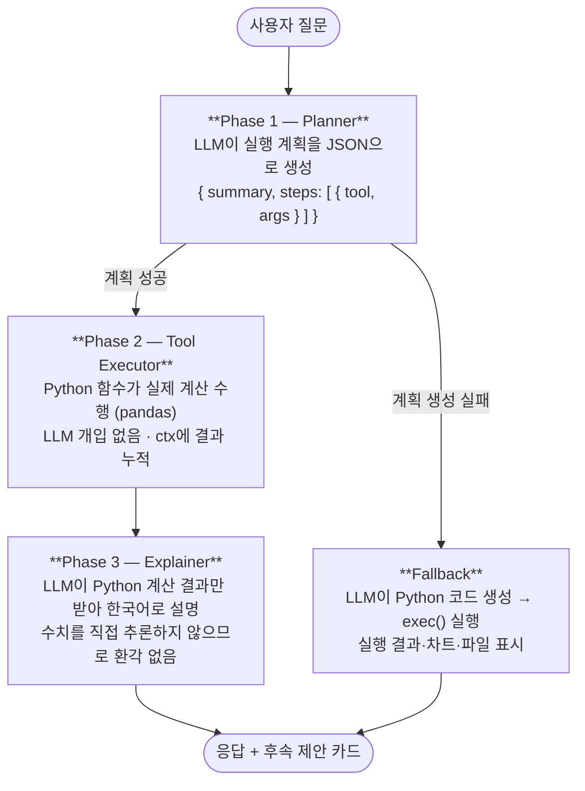
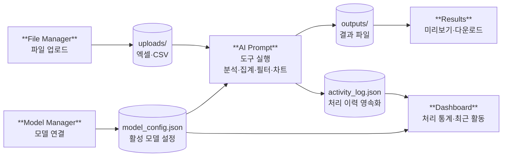
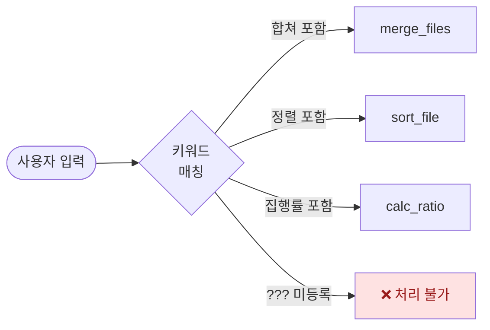
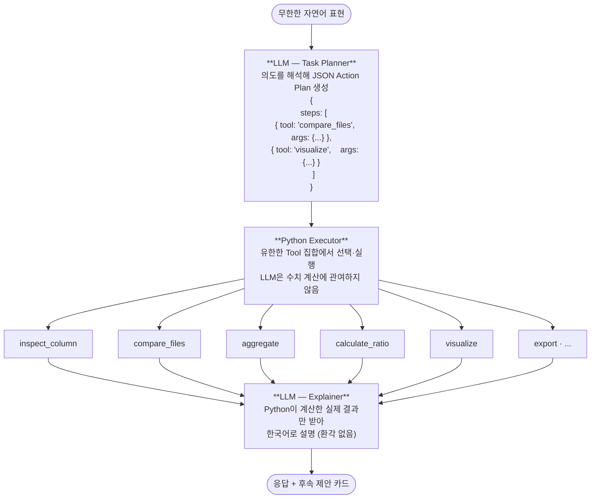
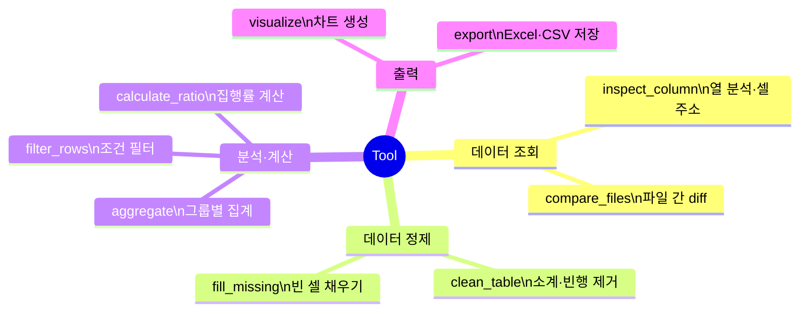

# AI Prompt Platform

엑셀·CSV 파일을 자연어로 분석·처리하는 Streamlit 기반 AI 데이터 플랫폼.
LLM이 직접 수치를 판단하지 않고, 구조화된 Python 도구가 실제 계산을 수행한 뒤 LLM이 결과만 설명하는 **2-Phase 아키텍처**로 환각(hallucination)을 방지합니다.

---

## 디렉토리 구조

```
ai-prompt-platform/
├── app.py                      # Dashboard
├── requirements.txt
├── model_config.json           # 활성 모델·API 키 (자동 생성)
├── activity_log.json           # 처리 이력 영속화 (자동 생성)
├── code_history.json           # Fallback 코드 히스토리 (자동 생성)
├── .streamlit/
│   └── config.toml             # 테마 설정
├── pages/
│   ├── 1_File_Manager.py       # 파일 업로드·미리보기
│   ├── 2_AI_Prompt.py          # AI 대화 (2-Phase Tool 아키텍처)
│   ├── 3_Model_Manager.py      # 모델 연결·관리
│   └── 4_Results.py            # 결과 파일 관리
├── utils/
│   ├── activity_log.py         # 로그 영속화 유틸리티
│   ├── ai_caller.py            # 단순 AI 호출 공유 유틸
│   ├── excel_processor.py      # 엑셀 처리 유틸리티
│   └── ollama_client.py        # Ollama HTTP 클라이언트
├── uploads/                    # 업로드 파일 저장소
└── outputs/                    # 결과 파일 저장소
```

---

## 설치 및 실행

```bash
pip install -r requirements.txt
streamlit run app.py
```

### 의존 패키지

| 패키지 | 용도 |
|---|---|
| streamlit ≥ 1.30 | UI 프레임워크 |
| pandas ≥ 2.0 | 데이터 처리 |
| openpyxl ≥ 3.1 | 엑셀 읽기·쓰기 (병합 셀 처리 필수) |
| matplotlib ≥ 3.7 | 차트 생성 |
| altair ≥ 5.0 | 대시보드 바 차트 |
| openai ≥ 1.0 | OpenAI API |
| requests ≥ 2.31 | Ollama HTTP 통신 |
| google-generativeai | Google Gemini (선택, requirements.txt 주석 해제) |

---

## 페이지별 기능

### Dashboard (`app.py`)

플랫폼 전체 현황을 한눈에 보여주는 메인 화면.

- **메트릭 카드 4개**: 업로드 파일 수 / 처리 건수 / 활성 모델 / 토큰 사용량
- **활성 모델 표시**: 우상단 배지 — 미설정 시 경고 배너 표시
- **최근 활동**: `activity_log.json` 기반, 상태 배지(uploaded / processed / saved / deleted / error)
- **주간 통계 차트**: 최근 7일 성공 처리 건수 Altair 바 차트
- **빠른 시작**: 모델 미설정 시 단계 안내 / 설정 완료 시 프롬프트 예시 6개

---

### File Manager (`pages/1_File_Manager.py`)

엑셀·CSV 파일 업로드 및 상세 미리보기.

- **파일 업로드**: 드래그&드롭 (xlsx / xls / csv), `uploads/` 저장
- **파일 목록**: 이름·날짜·크기 표시, 검색 필터, 체크박스 일괄 삭제
- **AI Prompt 연동**: 선택 파일을 AI Prompt 페이지로 바로 전송
- **미리보기 다이얼로그 — 4탭 구성**:
  - `원본`: openpyxl로 원본 시트 그대로 렌더링 (병합 셀 표시 포함)
  - `정리 데이터`: pandas로 읽은 분석용 테이블 + 컬럼별 통계 (숫자: 합계/평균/최솟값/최댓값 / 텍스트: 고유값 목록)
  - `AI 분석`: 활성 모델로 자동 인사이트 생성 (페이지 로드 시 자동 실행, 결과 캐시)
  - `작업 로그`: 해당 파일에 대한 `activity_log.json` 이력 + 세션 코드 히스토리

---

### AI Prompt (`pages/2_AI_Prompt.py`)

핵심 기능. 자연어 질문 → Python 도구 실행 → AI 결과 설명.

#### 아키텍처: 2-Phase LLM + Python Tools



#### 9개 Python Tool 함수

모든 Tool은 `(args: dict, ctx: dict, dfs: dict) -> dict` 시그니처를 공유.
`ctx`에 이전 Tool 결과가 누적되어 다음 Tool이 참조 가능.

| Tool | 설명 | 주요 args |
|---|---|---|
| `inspect_column` | 열 상세 분석 (셀 주소 포함) | `file`, `column` |
| `compare_files` | 두 파일 diff (추가/제거/변경) | `file_a`, `file_b`, `key_col` |
| `clean_table` | 소계·빈 행 제거 | `file`, `remove_subtotals` |
| `aggregate` | 그룹별 집계 (sum/mean 등) | `file`, `group_by`, `value_col`, `func` |
| `filter_rows` | 조건 행 필터 | `file`, `column`, `condition`, `value` |
| `calculate_ratio` | 집행률 자동 계산 (계획/실행 컬럼 자동 탐지) | `file`, `plan_col`, `exec_col` |
| `fill_missing` | 빈 셀 채우기 | `file`, `method` (zero/ffill/mean) |
| `visualize` | 막대/선/파이 차트 생성 | `file`, `chart_type`, `x`, `y` |
| `export` | 결과를 Excel/CSV로 저장 | `source_step`, `filename` |

#### 엑셀 스마트 로딩 (`_read_excel_smart`)

`pd.read_excel()`의 한계를 openpyxl로 보완:

1. **병합 셀 해제**: 모든 병합 범위를 좌상단 값으로 채운 뒤 해제 → 병합으로 인한 NaN 방지
2. **2행 헤더 자동 감지**: 3번째 행에 숫자가 많고 2번째 행이 텍스트이면 1·2행을 합쳐 헤더 구성 (한국 공공 예산 엑셀 형식 대응)
3. **쉼표 포함 숫자 변환**: `'51,840,000'` → `51840000` (60% 이상 셀이 변환 가능하면 열 전체를 숫자형으로 변환)

#### 후속 작업 제안 카드

응답 하단에 실행된 Tool 기반으로 2~3개의 추천 카드 표시. 카드 클릭 시 해당 질문을 자동 입력.

#### 사이드바 기능

- 모델 선택 (Provider + Model)
- 파일 멀티선택 (File Manager에서 선택 파일 자동 연동)
- 코드 히스토리 (최근 8개, 클릭 시 재실행)
- 대화 초기화

---

### Model Manager (`pages/3_Model_Manager.py`)

AI 모델 연결 및 관리. 설정은 `model_config.json`에 영속화.

- **OpenAI**: API 키 입력, 모델 선택 (gpt-4o / gpt-4o-mini / gpt-4-turbo / gpt-3.5-turbo)
- **Ollama (local)**: `localhost:11434` 자동 감지, 설치된 모델 목록 표시, 모델 pull
- **Ollama (remote)**: 원격 서버 URL 직접 입력
- **Google Gemini**: API 키 입력, 모델 선택 (gemini-1.5-pro / gemini-1.5-flash / gemini-2.0-flash)
- 활성 모델 1개 지정 → 전체 플랫폼에서 공유
- Ollama 모델 전환 시 VRAM 정리 (이전 모델 unload)

---

### Results (`pages/4_Results.py`)

결과 파일 관리 및 대화 내보내기.

- **Chat 저장**: 현재 세션의 AI 대화를 Markdown 파일로 저장 (`outputs/`)
- **Markdown 작성**: 새 메모·보고서 직접 작성
- **파일 목록**: 파일명·유형 배지(markdown/excel/csv)·날짜·크기
- **미리보기**: `.md` → 렌더링 / `.xlsx,.xls` → 데이터프레임(최대 50행) / `.csv` → 데이터프레임
- **다운로드 / 삭제** 버튼

---

## 데이터 흐름



---

## 설계 철학: 자연어 → Task Planner → Tool 실행

### 기존 방식의 근본적 문제

초기 버전은 키워드 매칭 기반 **명령어 파서**였습니다.

```python
if "통합" in prompt or "합쳐" in prompt:
    merge_files()
elif "정렬" in prompt:
    sort_file()
```

표현이 조금만 달라져도 실패합니다. "5개 파일 합쳐줘"는 되지만, "B열 기준으로 정렬해줘"나 "3번째 시트만 추출해줘"처럼 사전에 등록하지 않은 요청은 전부 처리 불가능합니다. **질문이 새로 생길 때마다 코드를 추가**해야 하는 구조로, 확장성이 없습니다.



---

### 개선된 구조: 자연어 → Action Plan → Tool 실행

Cursor·Copilot과 동일한 구조입니다. 표현이 달라도 LLM이 의도를 해석해 **유한한 Tool 집합** 중 하나를 선택합니다.

```
"빈 셀 메꿔줘"
"병합셀 채워줘"        →  LLM 해석  →  fill_missing 호출
"누락값 처리해줘"

"달라진 항목 알려줘"
"증감 분석해줘"        →  LLM 해석  →  compare_files 호출
"변경점 요약해줘"
```



---

### 핵심 원칙: Tool 설계가 전부다

새 질문 유형이 생겨도 **Tool을 추가**하면 끝입니다. LLM이 알아서 새 Tool을 선택합니다.
반대로 Tool 설계가 나쁘면 LLM의 플래닝도 나빠집니다.

| 원칙 | 설명 |
|---|---|
| **범용성** | Tool 하나가 넓은 범위의 질문을 커버해야 함 |
| **명확한 args** | LLM이 잘못 해석할 수 없도록 args 이름을 직관적으로 |
| **결정론적 실행** | Tool 내부는 순수 Python — 같은 입력은 항상 같은 결과 |
| **ctx 누적** | 이전 Tool 결과를 다음 Tool이 참조 가능하도록 연결 |

현재 구현된 9개 Tool로 처리 가능한 실무 요청 범위:



---

### Fallback: 코드 생성 방식

Tool로 처리할 수 없는 요청(LLM이 Action Plan 생성에 실패한 경우)은 **코드 생성 방식**으로 전환됩니다. LLM이 pandas Python 코드를 직접 작성하고, `exec()`로 실행한 뒤 결과·차트·파일을 반환합니다. 파일의 실제 데이터(컬럼, 행 수, 샘플)를 시스템 프롬프트로 전달하므로 "샘플 데이터 기준" 가정 없이 동작합니다.


---

## 지원 모델

| Provider | 모델 예시 | 비고 |
|---|---|---|
| OpenAI | gpt-4o, gpt-4o-mini | API 키 필요 |
| Ollama (local) | llama3.1, gemma3, qwen2.5 등 | 무료, 로컬 실행 |
| Ollama (remote) | 동일 | GPU 서버 URL 지정 |
| Google Gemini | gemini-1.5-pro, gemini-2.0-flash | API 키 필요, 패키지 별도 설치 |
